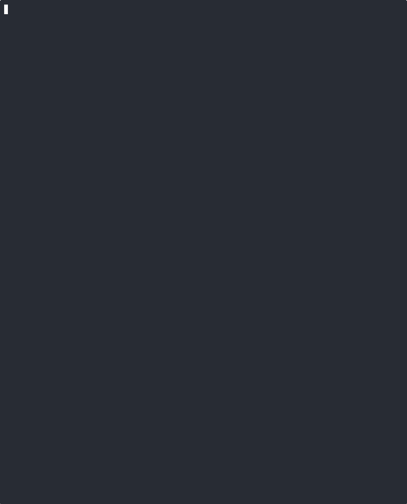
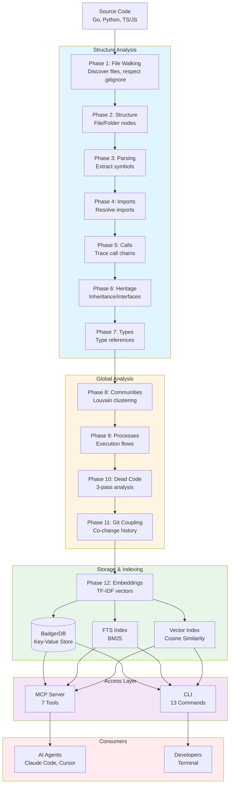

# Axon-Go An MCP server knowledge graph for AI code agents.

**The Go rewrite of Axon — Building the knowledge graph for AI code agents.**

> ⚠️ **This is a Go rewrite of the original [Axon](https://github.com/harshkedia177/axon) project by Harsh Kedia.** All credit for the original concept, design, and Python implementation goes to the original author. This Go implementation aims to provide single-binary deployment, improved concurrency, and 100% feature parity.

Indexes any codebase into a structural knowledge graph — every dependency, call chain, cluster, and execution flow — then exposes it through smart MCP tools so AI agents never miss code.

```
$ axon-go analyze .

Walking files...               142 files found
Parsing code...                142/142
Tracing calls...               847 calls resolved
Analyzing types...             234 type relationships
Detecting communities...       8 clusters found
Detecting execution flows...   34 processes found
Finding dead code...           8 unreachable symbols
Analyzing git history...       18 coupled file pairs
Generating embeddings...       623 vectors stored

Done in 0.8s — 623 symbols, 1,847 edges, 8 clusters, 34 flows
```


---

## Why Go?

The Go rewrite provides several improvements over the Python original:

- ✅ **Single binary deployment** — No Python runtime, pip, or virtualenv needed
- ✅ **100% feature parity** — All 12 pipeline phases, 13 CLI commands, full MCP server
- ✅ **Multi-language support** — Go, Python, and TypeScript parsers
- ✅ **Better concurrency** — Goroutines for parallel file processing
- ✅ **Watch mode** — Live re-indexing on file changes

---

## Quick Start

### Installation

```bash
# Install from source
git clone https://github.com/Benny93/axon-go.git
cd axon-go
make build

# Or install via go install
go install github.com/Benny93/axon-go@latest
```

### Basic Usage

```bash
# Index a repository
axon-go analyze .

# Start MCP server with watch mode (auto re-indexes on changes)
axon-go serve --watch

# Search the knowledge graph
axon-go query "authentication handler"

# Get 360° view of a symbol
axon-go context UserService

# Analyze blast radius
axon-go impact ValidateUser --depth 2

# Find dead code
axon-go dead-code
```

---

## MCP Tools

Axon-Go provides 7 MCP tools for AI code agents:

| Tool | Description |
|------|-------------|
| `axon_query` | Hybrid search (FTS + Vector with RRF fusion) |
| `axon_context` | 360° symbol view (callers, callees, type refs) |
| `axon_impact` | Blast radius analysis with depth control |
| `axon_dead_code` | Dead code detection with exemptions |
| `axon_detect_changes` | Change detection and impact analysis |
| `axon_list_repos` | List indexed repositories |
| `axon_cypher` | Raw graph queries (stub, not supported right now) |

### Example MCP Configuration


Important! Before you can use it with your project you need to run `axon-go analyze .` in your project.

Example config for qwen-cli in ~/.qwen/settings.json
```json
...
 "mcp": {
    "allowed": ["axon-go"]
  },
  "mcpServers": {
    "axon-go": {
      "args": [
        "serve",
        "--watch"
      ],
      "command": "<pathtoGoBin>/go/bin/axon-go",
      "timeout": 60000,
      "trust": true,
      "env": {},
      "includeTools": [
        "axon_query",
        "axon_context",
        "axon_impact",
        "axon_dead_code",
        "axon_list_repos",
        "axon_cypher"
      ]
    }
  }
```

---

## CLI Commands

| Command | Description |
|---------|-------------|
| `analyze [path]` | Index repository into knowledge graph |
| `query <query>` | Search using hybrid search (FTS + Vector) |
| `context <symbol>` | Get 360° view of a symbol |
| `impact <symbol>` | Analyze blast radius (configurable depth) |
| `dead-code` | List unreachable/dead code symbols |
| `watch` | Watch mode with live re-indexing |
| `diff <range>` | Structural branch comparison |
| `setup` | Configure MCP for AI tools |
| `mcp` | Start MCP server |
| `serve [--watch]` | MCP server with optional watch mode |
| `list` | List indexed repositories |
| `status` | Show index status |
| `clean [-f]` | Delete index |

---

## Pipeline Phases

Axon-Go processes code through 12 phases:



| Phase | Name | Description |
|-------|------|-------------|
| 1 | File Walking | Discovers files, respects .gitignore |
| 2 | Structure | Creates File/Folder nodes with CONTAINS edges |
| 3 | Parsing | Extracts symbols (functions, classes, etc.) |
| 4 | Imports | Resolves import statements |
| 5 | Calls | Traces function/method calls |
| 6 | Heritage | Tracks EXTENDS/IMPLEMENTS relationships |
| 7 | Types | Analyzes USES_TYPE relationships |
| 8 | Communities | Detects code clusters (Louvain algorithm) |
| 9 | Processes | Detects execution flows from entry points |
| 10 | Dead Code | 3-pass analysis with exemptions |
| 11 | Git Coupling | Analyzes co-change history |
| 12 | Embeddings | Generates TF-IDF vectors for semantic search |

---

## Supported Languages

| Language | Parser | Status |
|----------|--------|--------|
| Go | `go/parser` (AST) | ✅ Full support |
| Python | Regex-based | ✅ Full support |
| TypeScript/TSX | Regex-based | ✅ Full support |
| JavaScript | Regex-based | ✅ Full support |

---

## Storage

- **Backend:** BadgerDB (embedded key-value store)
- **Full-Text Search:** Custom BM25 implementation
- **Vector Search:** TF-IDF embeddings with cosine similarity
- **Hybrid Search:** Reciprocal Rank Fusion (RRF)

---

## Examples

### MCP Tool Usage

Axon-Go's knowledge graph (powered by BadgerDB) is exposed through MCP tools. Here's how AI agents interact with it:

**Start the MCP server:**
```bash
axon-go serve --watch
```

**Example tool calls:**

```json
// 1. Search for symbols related to "authentication"
{
  "tool": "axon_query",
  "arguments": {
    "query": "authentication handler",
    "limit": 10
  }
}

// 2. Get 360° view of a symbol (callers, callees, type refs)
{
  "tool": "axon_context",
  "arguments": {
    "symbol": "UserService.ValidateUser"
  }
}

// 3. Analyze blast radius before refactoring
{
  "tool": "axon_impact",
  "arguments": {
    "symbol": "Database.Connect",
    "depth": 2
  }
}

// 4. Find unreachable/dead code
{
  "tool": "axon_dead_code"
}

// 5. Detect changes and their impact
{
  "tool": "axon_detect_changes",
  "arguments": {
    "paths": ["src/auth.go", "src/user.go"]
  }
}

// 6. List all indexed repositories
{
  "tool": "axon_list_repos"
}
```

**Example workflow: Refactoring a function**

1. **Find the symbol:** `axon_query("user validation logic")`
2. **Understand dependencies:** `axon_context("UserService.ValidateUser")`
3. **Check impact:** `axon_impact("UserService.ValidateUser", depth=2)`
4. **Make changes** (AI edits code)
5. **Verify no breakage:** `axon_detect_changes(paths=["src/user.go"])`

### BadgerDB Backend (Internal)

The MCP tools query a knowledge graph stored in BadgerDB. Key storage methods:

| Method | Description |
|--------|-------------|
| `Initialize(path, readOnly)` | Open BadgerDB at path |
| `GetNode(ctx, id)` | Retrieve a graph node |
| `GetCallers(ctx, symbol)` | Find all callers of a symbol |
| `GetCallees(ctx, symbol)` | Find all symbols called by this one |
| `HybridSearch(ctx, query, limit)` | Combined keyword + vector search |
| `VectorSearch(ctx, vector, limit)` | Semantic search via embeddings |
| `GetDeadCode(ctx)` | Find unreachable symbols |
| `GetNodesByLabel(ctx, label)` | Query nodes by label |

---

## Project Structure

```
axon-go/
├── cmd/                    # CLI commands
├── internal/
│   ├── embeddings/         # TF-IDF embedding generation
│   ├── graph/              # Knowledge graph data model
│   ├── ingestion/          # 12-phase pipeline
│   ├── parsers/            # Language parsers
│   └── storage/            # BadgerDB backend
├── mcp/                    # MCP server
├── Makefile                # Build targets
└── go.mod                  # Go module definition
```

---

## Development

```bash
# Build
make build

# Run tests
make test

# Run linter
make lint

# Run all checks
make check

# Clean build artifacts
make clean
```

---

## Migration from Python Axon

```bash
# Uninstall Python version
pip uninstall axon

# Install Go version
go install github.com/Benny93/axon-go@latest

# Re-index (index format is different)
axon-go analyze .
```

**What stays the same:**
- All CLI commands work identically
- MCP tools have same names and behavior
- Output formats are compatible

**What improves:**
- Single binary deployment
- Improved concurrency with goroutines

---

## Acknowledgments

This project is a Go rewrite of **[Axon](https://github.com/harshkedia177/axon)** by **Harsh Kedia**. 

- **Original Concept & Design:** Harsh Kedia
- **Python Implementation:** Harsh Kedia
- **Go Implementation:** Benjamin Vollmer

All credit for the original vision, architecture, and Python implementation belongs to the original author. This Go implementation aims to preserve and extend that work with improved deployment characteristics.

---

## License

MIT License

---

## Contributing

Contributions welcome!

1. Fork the repository
2. Create a feature branch
3. Make your changes
4. Run tests: `make test`
5. Run linter: `make lint`
6. Submit a pull request

---

**Built with ❤️ using Go**
